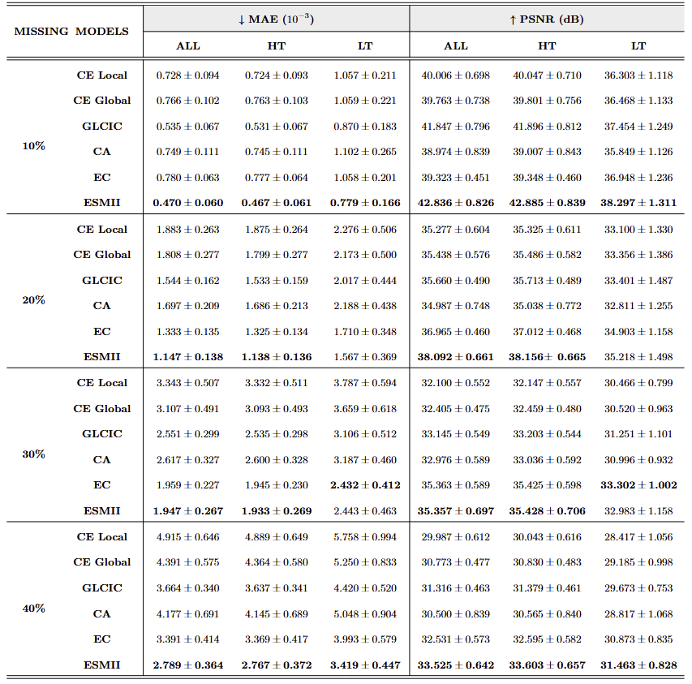
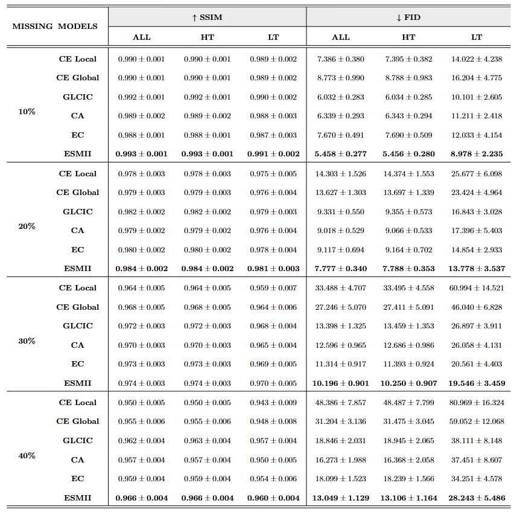
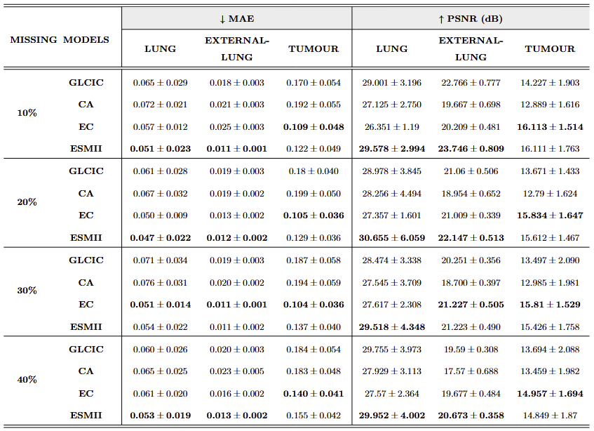
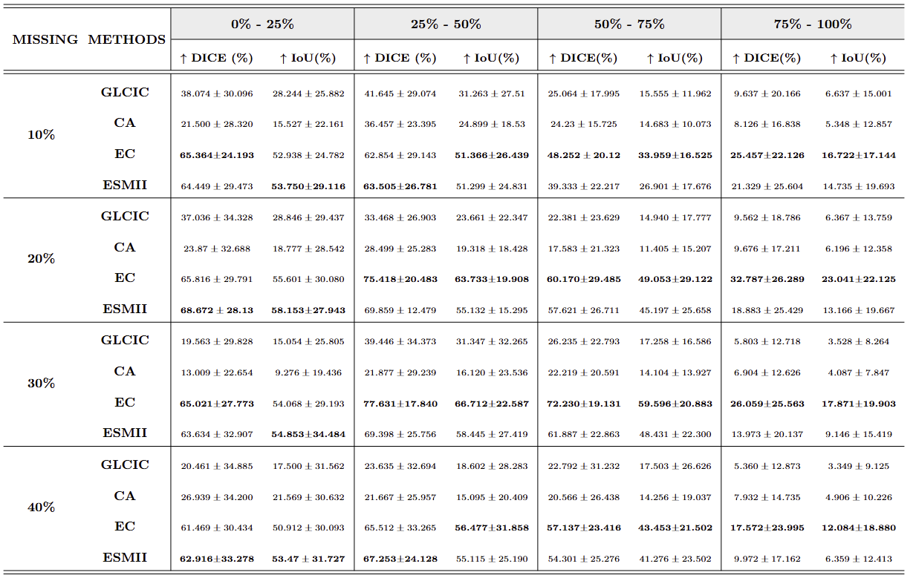

# Exploring Different Imputation Techniques in the Reconstruction of CT Lung Images

Welcome to the official repository of our project, **Exploring Different Imputation Techniques in the Reconstruction of CT Lung Images**. This repository provides a comprehensive research guide and additional resources, including detailed explanations, images and notebooks.

---

## Abstract
Despite significant technological advancements, Computed Tomography (CT) scans remain vulnerable to artefacts and errors, leading to the loss of critical medical information and clinical efficacy. This study investigates the reconstruction of missing or corrupted regions in lung CT images by comparing five established image imputation models &mdash; *Context Encoder* (CE), *{Global and Local Consistency Image Completion* (GLCIC), *Contextual Attention* (CA), *Edge-Connected* (EC) and *Edge and Structure Information for Medical Image Inpainting* (ESMII). These learning-based algorithms are evaluated using a 10-fold cross-validation approach on a dataset comprising 5,350 transverse slices from 31 chest CT volumes of patients with non-small cell lung cancer. The assessment encompasses four levels of missing data &mdash; 10%, 20%, 30% and 40% &mdash; which correspond to the proportion of missing pixels relative to the total number of lung tissue pixels in each image. The ESMII algorithm demonstrates superior overall performance across all percentages of missing data, consistently achieving accurate structural and textural reconstructions. However, in the context of tissue typology analysis and tumour mass reconstruction, the EC model exhibits the highest imputation performance across nearly all scenarios. However, from a broader perspective, the effectiveness of all models in reconstructing these noisy patterns remains limited. Given the novelty and potential of these techniques in medical applications, future research should focus on refining existing models, exploring new patterns of missing data and incorporating expert validation to enhance the clinical applicability of these methodologies.

---
## Project Overview
This project is organized into three primary procedural steps &mdash; Preprocessing Steps, Missing Data Generation and Missing Data Reconstruction &mdash; as illustrated in Figure 1. The entire methodology, from image processing tasks to Machine Learning (ML) algorithms, was implemented using *Python*.

    
     
    <em><strong>Figure 1:</strong> Diagram of the experimental procedure developed.</em>

## Key Results
This study’s results capture the performance of various inpainting techniques for reconstructing missing or corrupted regions in lung CT images. Through quantitative and qualitative analyses, the study assessed each model's effectiveness in reconstructing essential tissue characteristics and handling complex structural and textural challenges. The sections below provide a comparative perspective on each model’s effectiveness, as well as insights into their strengths and limitations across varied reconstruction scenarios.

- ### Qualitative Results
Although these conclusions have not yet been medically validated, the qualitative analysis offers insights into the realism and coherence of the reconstructions, particularly concerning the characteristics of the missing data, as shown in Figure 8, 9 and 10.

    
     
    <em><strong>Figure 8:</strong> Qualitative results of inpainting models on pulmonary tissue structures, with rows showing input images with 10%, 20%, 30% and 40% of missing data. The final column presents ground truth data; blue arrows mark expected reconstructions and green arrows indicate consistent results.</em>

    
     
    <em><strong>Figure 9:</strong> Qualitative results of inpainting models on pulmonary parenchyma missings, with rows showing input images with 10%, 20%, 30% and 40% of missing data. The final column presents ground truth data; blue arrows mark expected reconstructions and green arrows indicate consistent results.</em>

    
     
    <em><strong>Figure 10:</strong> Qualitative results of inpainting models on images with total missing structures, with rows showing input images with 10%, 20%, 30% and 40% of missing data. The final column presents ground truth data; blue arrows mark expected reconstructions and green arrows indicate consistent results.</em>

 

The ESMII model delivered some of the highest-quality reconstructions, with outputs nearly indistinguishable from valid regions, even at high missing data levels. While it excelled in texture replication, it struggled with finer details, particularly in capturing certain "roughness."

   - ### Quantitative Results
     - #### Overall Analysis
      According to Table 1 and 2, the ESMII model consistently outperformed other models across missing data levels in pixel-based evaluations (MAE and PSNR). For image consistency, ESMII again excelled, with FID indicating significant advantages over the other models. Additionally, the EC model excelled in HT but declined in LT, highlighting a performance shift with tissue complexity.

      

          <em><strong>Table 1:</strong> Quantitative results obtained after testing all the inpainting models compared during this study, based on a pixel-based approach. This approach was designed to assess the algorithms’ performance in healthy tissues (HT), tissues with tumour lesions (LT), and their combination (ALL). Note that the up and down arrows next to the metrics indicate the optimal direction for the models’ test parameters evolution. The values in bold highlight the best values for each condition.</em>
      

      

          
      

      
      

          <em><strong>Table 2:</strong> Quantitative results obtained after testing all the inpainting models compared during this study, based on an image consistency evaluation. This approach was designed to assess the algorithms’ performance in healthy tissues (HT), tissues with tumour lesions (LT), and their combination (ALL). Note that the up and down arrows next to the metrics indicate the optimal direction for the models’ test parameters evolution. The values in bold highlight the best values for each condition.</em>
      

      

          
      

     - #### Tissues-Based Analysis
      Table 3 highlights that imputation models had divergent performances across different tissue types. Lung tissue showed the highest reconstruction accuracy, followed by extra-pulmonary and tumour tissues, reflecting varying noise levels. The ESMII model outperformed others in reconstructing lung and extra-lung tissues, while the EC model excelled in tumour reconstructions. EC’s strong performance in structural reconstruction suggests a preference for structural details over texture, particularly for tumour reconstruction.

      

          <em><strong>Table 3:</strong> Qualitative results from testing the top-performing inpainting models across Lung, External-Lung, and Tumour tissues, with bold values marking the best performance and arrows indicating the optimal direction of metric evolution.</em>
      

      

          
      

      
     - #### Tumoural Omission Analysis
      Table 4 shows that reconstructing tumour masses in missing regions was challenging, particularly as tumour omission increased. The EC model was most effective in detecting lesions under high omission scenarios, although variability in outcomes resulted in minimal statistical differences compared to the ESMII model.

      

          <em><strong>Table 4:</strong> Qualitative results focusing on tumour reconstruction by measuring the tumour overlap between generated and original data. Bold values indicate the best performance and arrows show the optimal metric direction.</em>
      

      

          
      

      
---

## Contact

Feel free to connect with me on [LinkedIn](https://www.linkedin.com/in/hugo-tomas-alexandre/) or reach out via email at [hugotomas.2001@outlook.pt](mailto:hugotomas.2001@outlook.pt.com) for any inquiries.

**Please note that some parts of the code related to dataset manipulation, such as compression, uniformization and other preprocessing steps, have been omitted. This is due to the fact that these parts of the code are not yet well-organized for direct inclusion here. Additionally, some of the statistical analysis code is also missing for similar reasons, but I would be happy to provide these upon request.**
