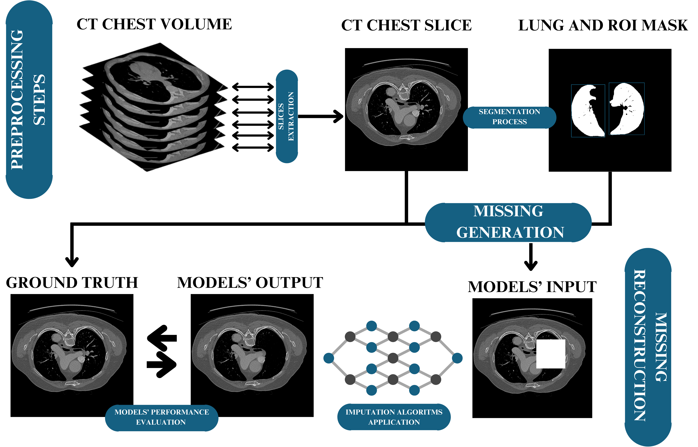
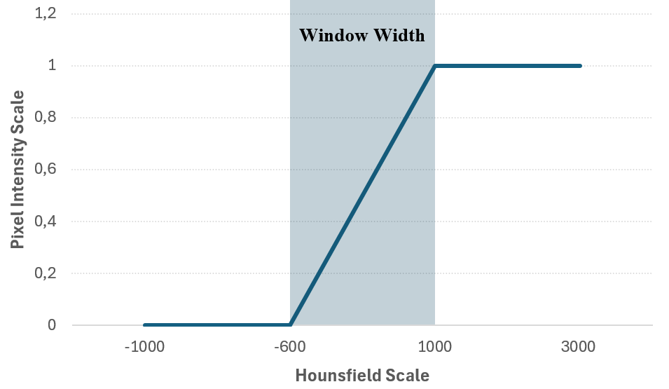
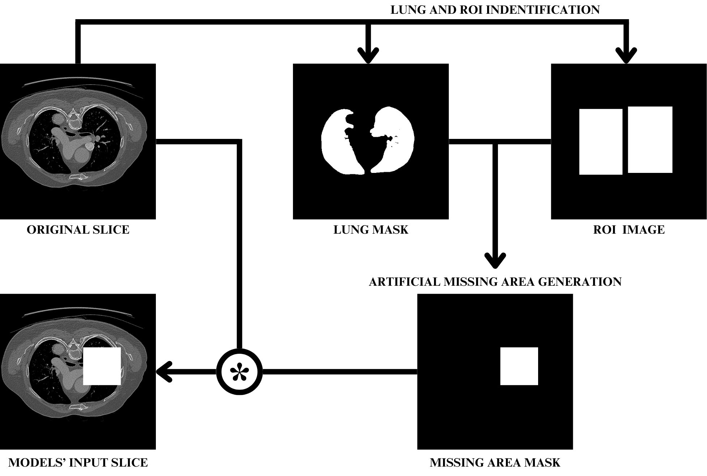
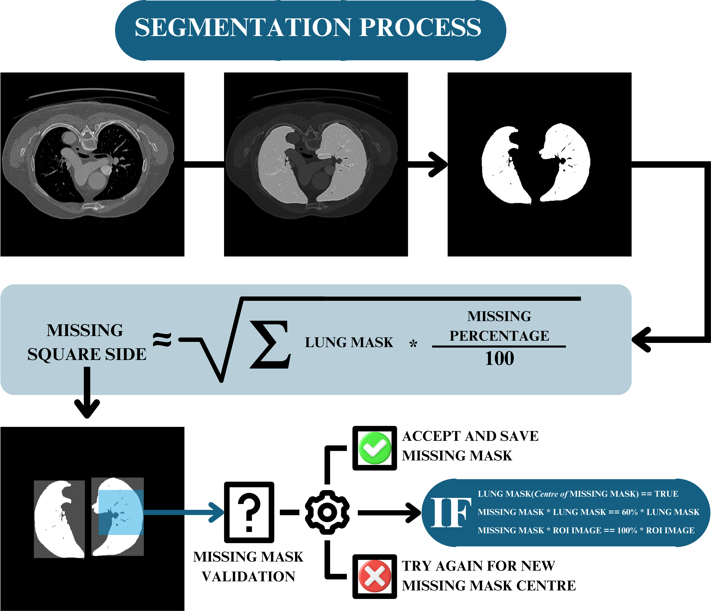
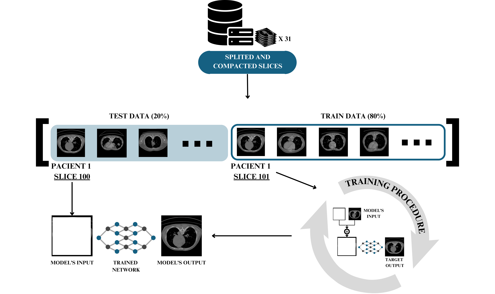

# Exploring Different Imputation Techniques in the Reconstruction of CT Lung Images

Welcome to the official repository of our project, **Exploring Different Imputation Techniques in the Reconstruction of CT Lung Images**. This repository provides a comprehensive research guide and additional resources, including detailed explanations, images and notebooks.

---

## Abstract
Despite significant technological advancements, Computed Tomography (CT) scans remain vulnerable to artefacts and errors, leading to the loss of critical medical information and clinical efficacy. This study investigates the reconstruction of missing or corrupted regions in lung CT images by comparing five established image imputation models &mdash; *Context Encoder* (CE), *{Global and Local Consistency Image Completion* (GLCIC), *Contextual Attention* (CA), *Edge-Connected* (EC), and *Edge and Structure Information for Medical Image Inpainting* (ESMII). These learning-based algorithms are evaluated using a 10-fold cross-validation approach on a dataset comprising 5,350 transverse slices from 31 chest CT volumes of patients with non-small cell lung cancer. The assessment encompasses four levels of missing data &mdash; 10%, 20%, 30% and 40% &mdash; which correspond to the proportion of missing pixels relative to the total number of lung tissue pixels in each image. The ESMII algorithm demonstrates superior overall performance across all percentages of missing data, consistently achieving accurate structural and textural reconstructions. However, in the context of tissue typology analysis and tumour mass reconstruction, the EC model exhibits the highest imputation performance across nearly all scenarios. However, from a broader perspective, the effectiveness of all models in reconstructing these noisy patterns remains limited. Given the novelty and potential of these techniques in medical applications, future research should focus on refining existing models, exploring new patterns of missing data and incorporating expert validation to enhance the clinical applicability of these methodologies.

## Table of Contents
1. [Introduction](#introduction)
2. [Related Work](#related-work)
3. [Methodology](#methodology)
   - [Preprocessing Steps](#preprocessing-steps)
   - [Missing Generation](#missing-generation)
   - [Missing Reconstruction](#missing-reconstruction)
4. [Results](#results)
   - [Qualitative Results](#qualitative-results)
   - [Quantitative Results](#quantitative-results)
     - [Overall Analysis](#overall-analysis)
     - [Tissues-Based Analysis](#tissues-based-analysis)
     - [Tumoural Omission Analysis](#tumoural-omission-analysis)
5. [Conclusion and Future Work](#conclusion-and-future-work)
6. [References](#references)
7. [Contact](#contact)

---

## Introduction
In recent decades, the integration of imaging technologies into the medical domain has become indispensable in modern healthcare, facilitating a substantial transition from a reactive to a preventive medical paradigm [1]. Currently, medical imaging serves as one of the fundamental pillars of healthcare, particularly in diagnostics, providing invaluable insights into the anatomical and functional intricacies of the human body ( background knowledge details can be consulted [HERE](./docs/BackgroundKnowledge.pdf) ) [1].

Computed Tomography (CT) is among the most widely utilized and significant imaging modalities. Over 300 million CT scans are estimated to be performed globally each year [2]. However, despite the clinical efficacy of CT in medical decision-making, the imaging process is susceptible to failure due to its dependence on millions of individual sensor measurements. These errors can adversely affect medical decisions, particularly in critical scenarios such as oncology, where such failures can impact patient outcomes and disrupt subsequent post-processing algorithms for classification or segmentation tasks [3,4].

A study from a Belgian imaging centre found that approximately 2.5\% of CT scans were rejected and subsequently repeated by radiographers [5]. Extrapolating this rejection rate indicates that around 7.5 million additional scans are conducted annually. This situation not only increases patient radiation exposure but also imposes substantial financial burdens on healthcare systems [6].

Image imputation &mdash; also referred to as inpainting or image completion &mdash; offers a promising alternative to reduce the need for repeat examinations. This approach encompasses a range of techniques designed to reconstruct distorted or missing regions in flawed scans, generating high-quality structures, consistent with the original data [7].

In light of the aforementioned challenges and statistics, this study focuses specifically on lung CT images, emphasising lung tissue. This approach investigates pulmonary tissue's structural and textural restoration in images containing missing data, utilizing the surrounding available information. Beyond the high medical demand, pulmonary tissues exhibit distinct structural and textural characteristics and a significant incidence of lesions, such as malignant masses, which provide a robust foundation for exploring imputation techniques within this context.

## Related Work

Traditional methods for inferring missing image data primarily rely on mathematical and statistical models. However, they often struggle to capture high-level semantic details, focusing instead on local data rather than the broader image context [7]. To overcome these limitations, learning-based models such as Convolutional Neural Networks (CNNs) and Generative Adversarial Networks (GANs) have emerged as prominent alternatives, significantly improving image imputation by capturing high-level patterns imperceptible to the human eye [7].

Recent advancements in image inpainting have led to the development of innovative models that enhance reconstruction processes. In the literature, Pathak et al. (2016) [8] introduced the *Context Encoder* (CE), recognized as one of the first models specialized in image imputation, which employs an encoder-decoder architecture with fully connected layers for reconstructing square missing masks. Building on this foundation, Iizuka et al. (2017) [9] developed the *Global and Local Consistency Image Completion* (GLCIC), which integrates dual discriminators to improve both local and global consistency in the generated images. Further refining inpainting techniques, Yu et al. (2018) [10] proposed the *Contextual Attention* (CA) model, which employs a two-stage approach to consider surrounding features, allowing for more effective filling of multiple holes of varying sizes. The *EdgeConnect* (EC) model introduced by Nazeri et al. (2019) [11] distinguishes itself by first predicting edge structures, utilizing this information to guide the inpainting process and enhance texture alignment. Similarly, Wang et al. (2021) [12] presented the *Edge and Structure Multi-Scale Image Inpainting* (ESMII) model, which incorporates both edge information and structural details extracted after a texture removal process, employing multi-scale feature extraction throughout the inpainting procedure.

In the medical field, image imputation techniques have predominantly been applied in Computed Tomography (CT) and Magnetic Resonance Imaging (MRI). These algorithms typically aim to rectify non-anatomic artefacts, such as streaking caused by metal, motion or issues related to the field of view (FOV) and patient positioning [13]. Recent trends indicate an increasing integration of these techniques into more complex algorithms, including segmentation models, where inpainting appears as an intermediate step within the processing pipeline [13].

Despite the promising results in this field ( which can be explored in more detail in [HERE](./docs/LiteratureReview.pdf) ), particularly in clinical applications where these techniques have demonstrated substantial impact, further exploration and development are necessary for a comprehensive understanding of the actual methods' effects on specific anatomical structures and tissues.

## Methodology
This chapter is organized into three primary procedural sections &mdash; Preprocessing Steps, Missing Data Generation and Missing Data Reconstruction &mdash; as illustrated in Figure 1. The entire methodology, from image processing tasks to Machine Learning (ML) algorithms, was implemented using *Python*.

    
     
    <em><strong>Figure 1:</strong> Diagram of the experimental procedure developed.</em>

   - ### Preprocessing Steps
The dataset for this study was sourced from the Medical Segmentation Decathlon (MSD) and comprised 95 chest CT volumes from The Cancer Imaging Archive (TCIA) [14,15]. Of these, only 63 scans included 3D annotations identifying non-small cell lung tumours, leading to the remaining volumes' exclusion from further analysis.

To ensure consistency across the dataset, variations in the field of view (FOV) acquisition required standardization, with only scans having slice counts within the first and third quartiles retained. This process resulted in a final selection of 31 volumes. A lung identification step was then applied, selecting only slices that contained pulmonary structures. Together, these steps yielded a set of 5,350 transverse slices, with an average of 172.58 slices per scan and a standard deviation of 18.52, which were used to train and evaluate the imputation models.

Pixel values, originally measured in *Hounsfield* Units (HU), were then normalized to a range of $[0, 1]$ following a windowing process from $[-600, 1000]$ HU, as illustrated in Figure 2. This normalization accommodated the density ranges of both thoracic and carcinogenic tissues, ultimately supporting more accurate algorithmic comparisons during specific evaluation stages.

    
     
    <em><strong>Figure 2:</strong> Windowing process and respective conversion from *Hounsfield* to Pixel Intensity scale.</em>

    
   - ### Missing Generation
Unlike traditional methods that estimate missing pixels across the entire image, this approach focused exclusively on the lung area, weighting the missing data relative to the amount of omitted pulmonary tissue. For example, consider a slice with a resolution of $256 \times 256$ pixels and a missing data level of $10\%$. Conventional methods would calculate missing pixels as $256 \times 256 \times 0.1 \approx 6,554$ pixels. In contrast, assuming the lung region comprises $50\%$ of the image area, or $256 \times 256 \times 0.5 \approx 32,768$ pixels, this method calculates missing pixels as $(256 \times 256 \times 0.5) \times 0.1 \approx 3,277$ pixels. This lung-focused approach resulted in variable missing region sizes, even for a fixed percentage of missing data, ensuring that images with smaller lung areas had fewer omitted pixels than those with larger lung regions.

To comprehensively assess the models, four levels of missing data &mdash; 10\%, 20\%, 30\%, and 40\% &mdash; were applied using a square pattern that densely removed information, allowing models' performance analysis under progressive data loss, as outlined in Figure 3. To maintain focus on the lung tissue, the centre of the missing region was assumed to fall within the lung mask. However, due to the variable shapes of lung slices &mdash; particularly in the narrower, elongated inferior lobes &mdash; it was not always feasible to fully confine high-percentage missing data areas within the lung boundaries. To address this, as represented in Figure 4, a missing mask was deemed valid if at least $60\%$ of its pixels were within the lung area and $100\%$ were within the region of interest (ROI). This condition prevented the models trained on higher missing-data percentages from being restricted to medial lung slices with larger pulmonary cavities, enhancing generalizability across different lung regions.

    
     
    <em><strong>Figure 3:</strong> Minimalist schematic representative of the algorithm behind missing mask creation.</em>

    
     
    <em><strong>Figure 4:</strong> Visual representation of the process for creating and validating missing zones, using the masks from lung region segmentation and images of ROIs, previously extracted.</em>

In summary, this targeted approach provided a deeper understanding of how imputation models perform with tissues of distinct characteristics, especially in cases where missing data could compromise medical assessment accuracy. By refining the precision of reconstructed regions, this method aimed to yield more reliable clinical insights, improve ML model specificity, and minimize potential errors or inconsistencies during reconstruction.

   - ### Missing Reconstruction
This study compared several imputation models to evaluate their performance on different thoracic tissue types, each with distinct characteristics. The approach was based on the hypothesis that certain models may excel with specific tissue structures, even if their overall performance varied. Two adapted versions of the CE model [8], each focused on local and global discrimination, were highlighted alongside comparisons with other established models such as GLCIC [9], CA [10], EC [11] and ESMII [12].

A 10-fold cross-validation protocol was applied for training and testing phases across all imputation models to ensure robust and consistent results. This approach was adopted to address an issue observed during traditional dataset division, where a random split into training and test sets, as commonly practised in the literature, inadvertently led to slices from the same patient scan appearing in both sets, as demonstrated in Figure 5. This overlap allowed the reconstruction models to benefit from adjacent training slices, potentially inflating performance metrics by relying on neighbouring data rather than the intended independent slices.

    
     
    <em><strong>Figure 5:</strong> A potential overfitting scenario caused by the commonly used split approach between training and test sets. In this situation, slices 100 and 101 from the same CT volume are included in the test and training phases, respectively, leading the model to rely on memorization rather than learning during the training procedure. This particular overfitting effect is highlighted by a mask that covers 90% of the total image area, demonstrating an effective failure in the model’s generalization capacity.</em>

To provide fair comparison conditions, all models were trained and evaluated under standardized settings, including uniform data preprocessing, consistent training parameters **(100 epochs with a batch size of 8 slices)** and controlled testing environments. The experiments were conducted on a virtual machine equipped with an **Intel Xeon Silver 4314 CPU** at **2.40 GHz** and an **NVIDIA RTX A6000 GPU** with **47.95 GiB** of memory, ensuring consistent computational conditions across all techniques.

## 4. Results
During the evaluation phase, human perceptual coherence was combined with objective metrics, including pixel-based measures -- Mean Absolute Error (MAE) and Peak Signal-to-Noise Ratio (PSNR) &mdash; and feature-based metrics &mdash; Structural Similarity Index Measure (SSIM) and Fréchet Inception Distance (FID).

Alongside the overall analysis, a tissue-specific assessment was conducted to differentiate performance across three distinct tissue types: lung, surrounding external and carcinogenic tissues. Metrics were calculated separately for each category to highlight models' effectiveness in reconstructing structures with differing intrinsic properties, as illustrated in Figure 6.

    
     
    <em><strong>Figure 6:</strong> Procedure applied to evaluate the pixel-by-pixel performance of the frameworks, developed based on the anatomical differences between tissues.</em>

A tumour reconstruction analysis, shown in Figure 7, further assessed each model’s ability to reconstruct solid masses by identifying hyperdense regions. This analysis used the Dice coefficient (DICE), focusing on structural alignment rather than solely on pixel intensity. Lesion areas were categorized into four ranges based on the proportion of tumour tissue within the missing regions: $[0\%; 25\%]$, $[25\%; 50\%]$, $[50\%; 75\%]$ and $[75\%; 100\%]$; providing insights into reconstruction accuracy relative to the extent of missing carcinogenic tissue.

    
     
    <em><strong>Figure 7:</strong> Approach applied to analyze the reconstructive capacity of tumours.</em>

To validate these findings, statistical tests, including the Independent T-Test and Mann-Whitney U Test, were employed to evaluate the significance of performance differences between models. A significance level of $0.05$ was maintained across all analyses.

   - ### Qualitative Results
Although these conclusions have not yet been medically validated, the qualitative analysis offers insights into the realism and coherence of the reconstructions, particularly concerning the characteristics of the missing data, as shown in Figure \ref{fig:results_structure},\ref{fig:results_texture} and \ref{fig:results_omission}.

\begin{figure}[!ht]
    \centering
    \includegraphics[width=0.85\linewidth]{images/results_structure.png}
    \caption{Qualitative results of inpainting models on pulmonary tissue structures, with rows showing input images with 10\%, 20\%, 30\% and 40\% of missing data. The final column presents ground truth data; blue arrows mark expected reconstructions, and green arrows indicate consistent results.}
    \label{fig:results_structure}
\end{figure}

\begin{figure}[!ht]
    \centering
    \includegraphics[width=0.85\linewidth]{images/results_texture.png}
    \caption{Qualitative results of inpainting models on pulmonary parenchyma missings, with rows showing input images with 10\%, 20\%, 30\% and 40\% of missing data. The final column presents ground truth data; blue arrows mark expected reconstructions, and green arrows indicate consistent results.}
    \label{fig:results_texture}
\end{figure}

\begin{figure}[!htbp]
    \centering
    \includegraphics[width=0.85\linewidth]{images/results_omission.png}
    \caption{Qualitative results of inpainting models on images with total missing structures, with rows showing input images with 10\%, 20\%, 30\% and 40\% of missing data. The final column presents ground truth data; blue arrows mark expected reconstructions, and green arrows indicate consistent results.}
    \label{fig:results_omission}
\end{figure} 

The CE models produced the least effective reconstructions, likely due to their simpler architecture. The global discrimination variant resulted in diffuse images, while the local version exhibited grainy textures. Both faced challenges with extra-pulmonary structures, resulting in pixelated images and reduced coherence. In contrast, the GLCIC model offered more continuous delineations, although it still struggled with hyperdense tissues.

The CA model demonstrated notable capability in recreating vascular textures without graininess, but sometimes mismatched pixel intensities with adjacent regions. Despite this, CA maintained strong performance even with substantial data loss. The EC model excelled in capturing textural variation in hyperdense regions but struggled with bone delineation, producing occasional diffuse and unrealistic patterns while generally maintaining structural outlines despite large omissions.

The ESMII model delivered some of the highest-quality reconstructions, with outputs nearly indistinguishable from valid regions, even at high missing data levels. While it excelled in texture replication, it struggled with finer details, particularly in capturing certain "roughness." Finally, the MS method, though occasionally challenged by complex structures, generated realistic images with minimal discontinuities, achieving one of the closest textural matches to adjacent regions.

   - ### Quantitative Results
     - #### Overall Analysis
      In summary, pixel-based metrics like MAE and PSNR have limitations in capturing true textural relationships, as they may overlook texture recreation accuracy. Conversely, high-level metrics such as SSIM and FID better capture textural consistency but may still generate coherent images even when critical features, like tumours, are poorly reconstructed or missing.
      
      According to Table \ref{tab:results_overall}, the ESMII model consistently outperformed other models across missing data levels in pixel-based evaluations (MAE and PSNR). CE-based models performed well at lower omission levels but declined markedly with increased missing areas. The EC model enhanced performance at higher omission rates, suggesting suitability for certain applications. In evaluations across healthy (HT) and lesion tissues (LT), ESMII generally maintained superior metrics overall.
      
      For image consistency, ESMII again excelled, with FID indicating significant advantages over the MS model. CA model, despite lower pixel-based scores, achieved higher FID values than CE-based models, highlighting that high pixel accuracy alone does not equate to effective tissue reconstruction. SSIM remained high across both HT and LT, suggesting overall coherence but poor lesion reconstruction. FID further emphasized performance drops in CE-based models in the presence of lesions. Additionally, the EC model excelled in HT but declined in LT, highlighting a performance shift with tissue complexity.

     - #### Tissues-Based Analysis
      Table \ref{tab:tissues_results} highlights that imputation models had 
      divergent performances across different tissue types. Lung tissue showed the highest reconstruction accuracy, followed by extra-pulmonary and tumour tissues, reflecting varying noise levels. Lung tissue reconstructions had higher standard deviations due to their complex structures, while extra-pulmonary tissues showed less variability.
      
      The ESMII model outperformed others in reconstructing lung and extra-lung tissues, while the EC model excelled in tumour reconstructions. Statistical tests confirmed EC's advantage at lower missing rates, with the difference less significant at higher omission levels. EC’s strong performance in structural reconstruction suggests a preference for structural details over texture, particularly for tumour reconstruction.
      
     - #### Tumoural Omission Analysis
      Table \ref{tab:tumour_results} shows that reconstructing tumour masses in missing regions was challenging, particularly as tumour omission increased. With 75\% to 100\% of the tumour missing, reconstruction accuracy dropped due to limited external information, emphasizing the reliance on contextual cues.
      
      The EC model was most effective in detecting lesions under high omission scenarios, although variability in outcomes resulted in minimal statistical differences compared to the ESMII model. The MS model performed well at lower tumour omission levels but declined sharply as the omission increased, indicating its reliance on partial tumour data.
      
      Models did not solely depend on visible tumour data, because the absence of surrounding carcinogenic context impacted lesion reconstruction at higher omission rates. Notably, the CA model showed unexpectedly low DICE scores with 0\% to 25\% of tumour omission, suggesting that minor missing tumour areas may be deprioritized. In contrast, models like EC and ESMII, which use priors from other images, maintained more consistent performance across varying tumour omissions.
      
## 5. Conclusion and Future Work
In conclusion, this study examined various learning-based imputation models for reconstructing missing regions in lung CT images. Among the five established models -- \textit{Context Encoder} (CE), \textit{Global and Local Consistency Image Completion} (GLCIC), \textit{Contextual Attention} (CA), \textit{Edge-Connected} (EC), and \textit{Edge and Structure Information for Medical Image Inpainting} (ESMII) -- along with the novel approach -- \textit{Multi-Slice} (MS) -- ESMII demonstrated superior overall performance in both structural and textural reconstructions.

Both qualitative and quantitative assessments indicated that ESMII surpassed other models in reconstructing structural and textural data, sustaining consistent performance across varying levels of missing information. While ESMII generally exhibited statistically significant improvements, some comparisons with EC and MS revealed minimal or non-significant differences.

The proposed MS approach underscored the influence of external images on reconstruction accuracy, particularly in scenarios where specific tissues or structures were absent. This approach may, however, select similar samples that lack precise patterns within the missing areas. Thus, future iterations should consider developing mechanisms that enable the network to dynamically assess the relevance of external priors and modulate their impact, achieving an optimal balance between external features and self-sample information.

Notably, the EC model demonstrated high efficacy in reconstructing tumour masses, as evidenced by DICE across different levels of lesion omission, although variability in cancerous pattern reconstruction remains a challenge. Additionally, this analysis highlighted the significant role of surrounding tissues in enhancing lesion reconstruction, underscoring the distinct capacities of each model.

Nevertheless, tumour reconstruction remained challenging, underscoring the need for continued research to improve model capabilities in handling complex tissue structures and missing data patterns. Future advancements could benefit from integrating clinical expertise, exploring hybrid approaches and adapting to clinically relevant missing-data scenarios.

## 6. References

[1] Barsha Abhisheka, Saroj Biswas, Biswajit Purkayastha, Dolly Das, and Alexandre
Escargueil. Recent trend in medical imaging modalities and their applications in
disease diagnosis a review. Multimedia Tools and Applications, 83, 2023.

[2] Laura Sch&#246;ckel, Gregor Jost, Peter Seidensticker, Philipp Lengsfeld, Petra Palkowitsch,
and Hubertus Pietsch. Developments in x-ray contrast media and the potential impact
on computed tomography. Investigative Radiology, Publish Ahead of Print, 2020.

[3] Takuya Taniguchi, Takanori Hara, Tomohiro Shimozato, Fuminori Hyodo, Kose
Ono, Shuto Nakaya, Yoshifumi Noda, Hiroki Kato, Osamu Tanaka, and Masayuki
Matsuo. Effect of computed tomography value error on dose calculation in adaptive
radiotherapy with elekta x-ray volume imaging cone beam computed tomography.
Journal of Applied Clinical Medical Physics, 22:271–279, 2021.

[4] Joana Cristo Santos, Pedro Henriques Abreu, and Miriam Seoane Santos. The identifi-
cation of cancer lesions in mammography images with missing pixels: analysis of mor-
phology. In 2022 IEEE 9th International Conference on Data Science and Advanced
Analytics (DSAA), pages 1–8, 2022.

[5] Laura Haddad, Hanna Saleme, Nigel Howarth, and Denis Tack. Reject analysis in dig-
ital radiography and computed tomography: A belgian imaging department case study.
Journal of the Belgian Society of Radiology, 107:7, 2023.

[6] Alvin Jones, Dawit Woldemikael, Teresa Fisher, Gerry Hobbs, Bonhomme Prud’homme,
and George Bal. Repeated computed tomographic scans in transferred trauma patients:
Indications, costs, and radiation exposure. The journal of trauma and acute care surgery,
73, 2012.

[7] Xiaobo Zhang, Donghai Zhai, Tianrui Li, Yuxin Zhou, and Yang Lin. Image inpainting
based on deep learning: A review. Information Fusion, 90:74–94, 2023.

[6] Deepak Pathak, Philipp Kr¨ahenb¨uhl, Jeff Donahue, Trevor Darrell, and Alexei A. Efros.
Context encoders: Feature learning by inpainting. CoRR, abs/1604.07379, 2016.

[7] Satoshi Iizuka, Edgar Simo-Serra, and Hiroshi Ishikawa. Globally and locally consistent
image completion. ACM Trans. Graph., 36(4), 2017.

[8] Jiahui Yu, Zhe Lin, Jimei Yang, Xiaohui Shen, Xin Lu, and Thomas S. Huang. Generative
image inpainting with contextual attention. In 2018 IEEE/CVF Conference on Computer
Vision and Pattern Recognition (CVPR), pages 5505–5514. IEEE Computer Society,
2018.

[9] Kamyar Nazeri, Eric Ng, Tony Joseph, Faisal Qureshi, and Mehran Ebrahimi. Edge-
connect: Structure guided image inpainting using edge prediction. In 2019 IEEE/CVF
International Conference on Computer Vision Workshop (ICCVW), pages 3265–3274,
2019.

[10] Qianna Wang, Yi Chen, Nan Zhang, and Yanhui Gu. Medical image inpainting with
edge and structure priors. Measurement: Journal of the International Measurement
Confederation, 185, 2021.

[11] Lan Lan, Lei You, Zeyang Zhang, Zhiwei Fan, Weiling Zhao, Nianyin Zeng, Yidong Chen,
and Xiaobo Zhou. Generative adversarial networks and its applications in biomedical
informatics, 2020.

[12] Michela Antonelli, Annika Reinke, Spyridon Bakas, Keyvan Farahani, Annette Kopp-
Schneider, Bennett A. Landman, Geert Litjens, Bjoern Menze, Olaf Ronneberger, and
Ronald M. Summers et al. The medical segmentation decathlon. Nature Communications,
13, 2022.

## 7. Contact
